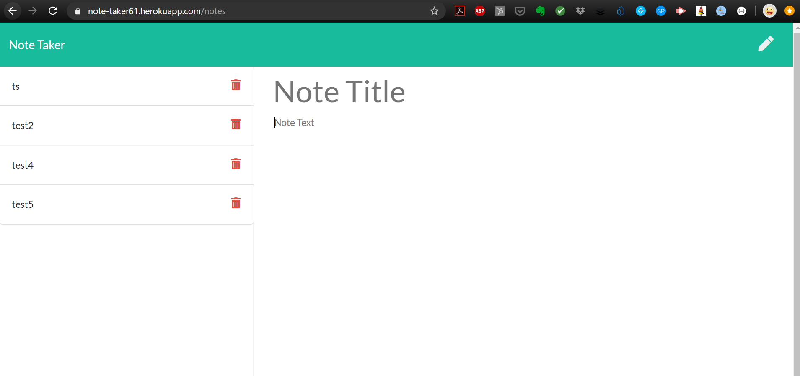

# Note Taker

## Description

A node.js express.js application that uses user input to create, store and delete notes. 

Below is the picture of the application:



Application deployed live on [heroku](https://note-taker61.herokuapp.com/)

```

## Table of Contents

- [Description](#description)
- [User Story](#user-story)
- [Acceptance Criteria](#acceptance-criteria)
- [Table of Contents](#table-of-contents)
- [Installation](#installation)
- [Usage](#usage)
- [Testing](#testing)
- [Contributing](#contributing)
- [Questions](#questions)

## Installation
  
`npm init`
  
`npm install node`

`npm install express`

`npm install jest --save-dev`

'`heroku create`

## Usage
  
Run the following command at the root of your project and answer the prompted questions:
  
`npm start`

## Testing

`npm install jest --save-dev`

## Contributing

[Richard Lim](https://github.com/lim95)

## Questions

✉️ Contact me with any questions: [email](mailto:sungjoon.lim@gmail.com) , [GitHub](https://github.com/lim95)<br />